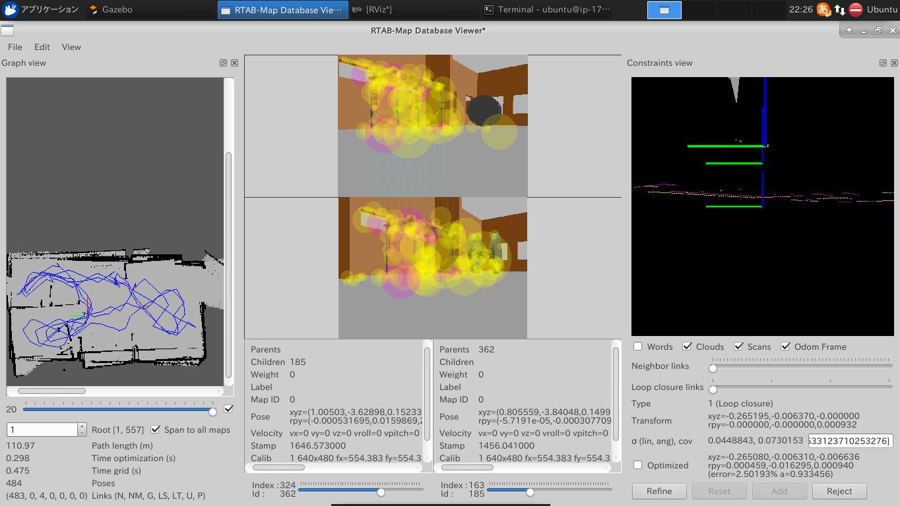

# About this project
[Udacity Robotics Software Engineer Nanodegree](https://www.udacity.com/course/robotics-software-engineer--nd209)
is one of Udacity classes, in which there are lectures about how to emulate
and control robots in ROS environment including gazebo, RViz, and so on.
The goal of this project "Map My World" Udacity student have to create
2D occupancy grid and 3D octomap from a simulated environment using the RTAB-Map package.

**RTAB-Map** (Real-Time Appearance-Based Mapping) is a popular solution for SLAM to develop
robots that can map environments in 3D. RTAB-Map has good speed and memory management,
and it provides custom developed tools for information analysis.

Using this project, [rtabmap.db file (zippped)](https://s3-ap-northeast-1.amazonaws.com/tnakae.github.com/udacity/rtabmap.db.zip) is generated as the map.

# Screenshot
This is screenshot of rtabmap-databaseView.



# Getting Started
1. Install ROS kinetic in Ubuntu 16.04 environment (time consuming step)
``` bash
$ sudo apt-get update
$ sudo apt-get install ros-kinetic-desktop-full
```
2. Install ROS packages used in this project.
``` bash
$ sudo apt-get install ros-kinetic-navigation
$ sudo apt-get install ros-kinetic-map-server
$ sudo apt-get install ros-kinetic-move-base
```
3. Clone this github repository.
``` bash
$ git clone https://github.com/tnakae/Udacity-RoboND-p4-MapMyWorld
```
4. Build.
``` bash
$ cd Udacity-RoboND-p4-MapMyWorld/catkin_ws/
$ catkin_make
```
5. Launch environment *in Ubuntu GUI*. It launches gazebo and RViz.
``` bash
$ source devel/setup.bash
$ roslaunch my_robot world.launch
```
6. *Open another terminal*, and launch mapping algorithm.
``` bash
$ cd Udacity-RoboND-p4-MapMyWorld/catkin_ws/
$ source devel/setup.bash
$ rosrun teleop_twist_keyboard teleop_twist_keyboard.py
```
7. *Open another terminal*, and launch mapping algorithm.
``` bash
$ cd Udacity-RoboND-p4-MapMyWorld/catkin_ws/
$ source devel/setup.bash
$ roslaunch my_robot mapping.launch
```
